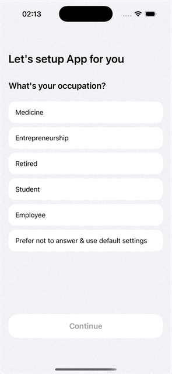

# Universe Group Onboarding

This project is a test task for Universe Group.

## 📲 Description

An onboarding flow built with UIKit based on a Figma design. Content is loaded dynamically from a remote API.

## 🛠 Tech Stack

- ✅ Swift
- ✅ UIKit
- ✅ SnapKit
- ✅ StoreKit 2
- ✅ Git
- ✅ Architecture: MVP

## 🔗 API

```bash
GET https://test-ios.universeapps.limited/onboarding
```

## ✨ Features

- Dynamic onboarding cards from API
- “Continue” button is disabled until the user selects an option
- Forward-only navigation
- Final screen includes:
  - Subscription with StoreKit 2
  - Privacy Policy link
  - Dismiss button

## 🚫 Limitations

- No storyboards or xibs
- No third-party libraries except SnapKit
- Deployment target: iOS 16.0

## 📸 Demo


<div style="margin-top: 50px;"></div><br><br>



